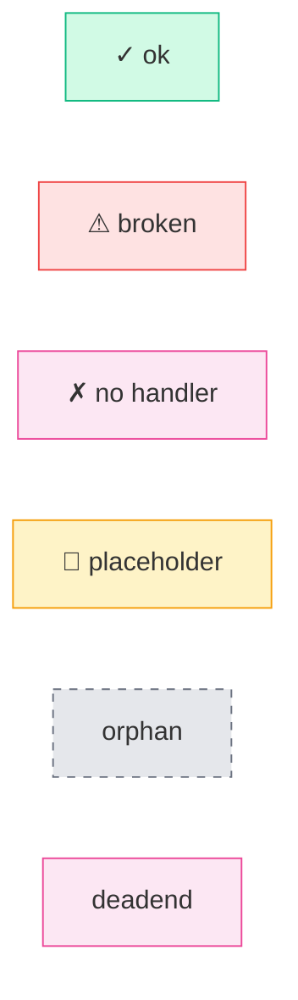
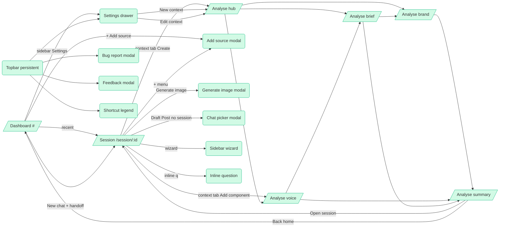
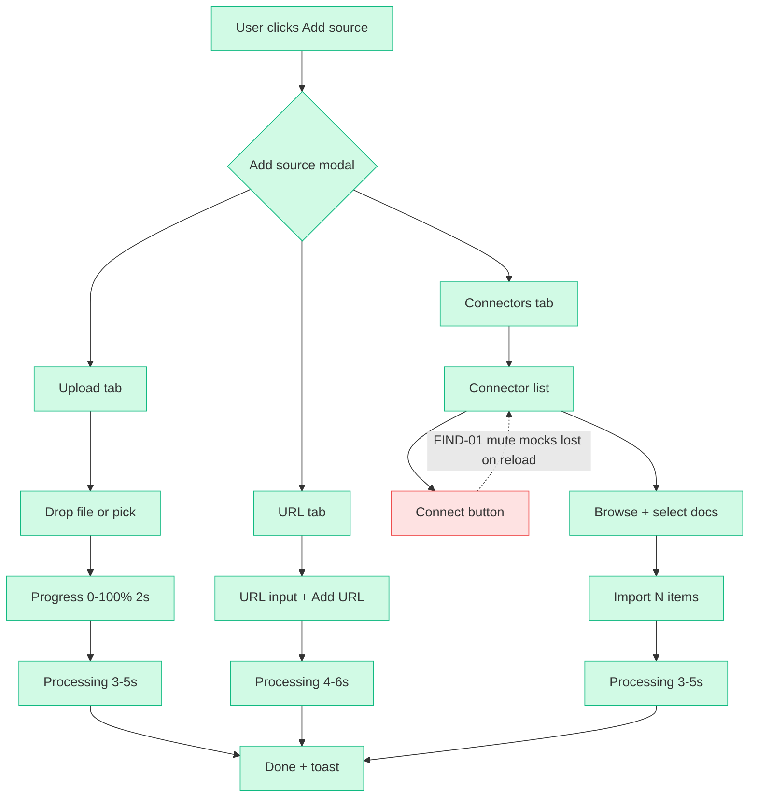
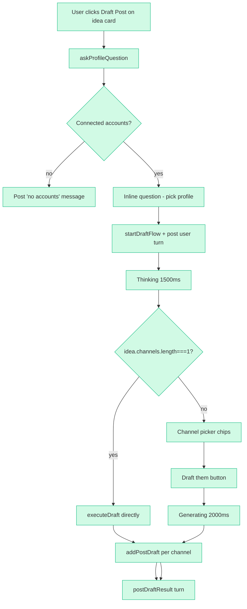
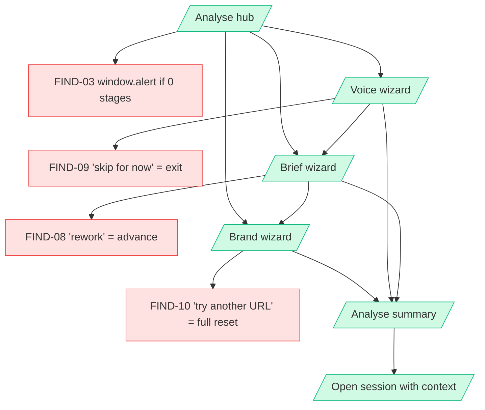
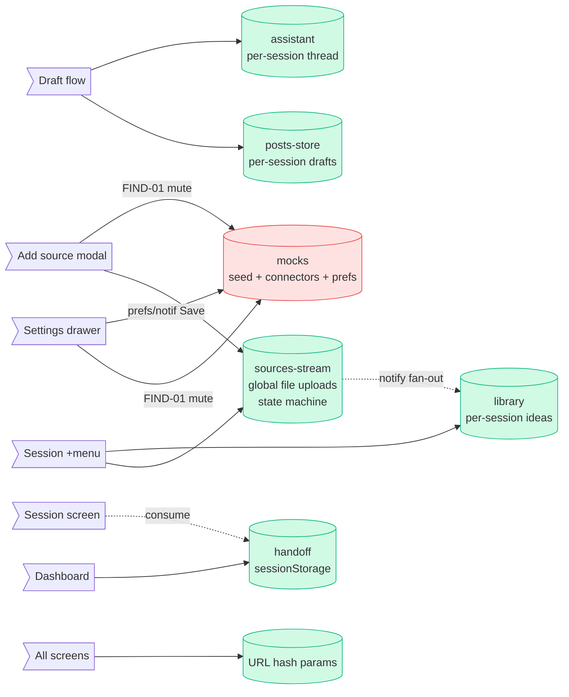
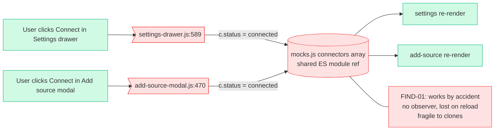

# Archie — Flow Audit

**Branche** : `chore/flow-audit` · **Phase 1** : 2026-04-27 (audit) · **Phase 2** : 2026-04-28 (fixes) · **Périmètre** : tout le proto

> Audit exhaustif des surfaces, éléments interactifs, triggers automatiques et flows. Identifie ce qui est cassé, orphelin, dupliqué ou placeholder. Phase 2 a appliqué **15/28 findings** (toutes les Medium + toutes les Safe + 7 Low). Voir `FLOW-CHANGELOG.md` pour le détail commit ↔ FIND-XXX.

## Phase 2 status banner

| Tier                 | Total | Done    | Deferred                   |
| -------------------- | ----- | ------- | -------------------------- |
| **Medium**           | 2     | **2** ✓ | 0                          |
| **Safe**             | 6     | **6** ✓ | 0                          |
| **Low** (UX-quality) | 20    | **7** ✓ | 13 (tracked for follow-up) |
| **TOTAL**            | 28    | **15**  | 13                         |

**Done in phase 2** : FIND-01, FIND-02, FIND-03, FIND-04, FIND-05, FIND-06, FIND-07, FIND-08, FIND-09, FIND-10, FIND-11, FIND-15, FIND-23, FIND-25, FIND-26.

**Deferred to a follow-up audit** : FIND-12, FIND-13, FIND-14, FIND-16, FIND-17, FIND-18, FIND-19, FIND-20, FIND-21, FIND-22, FIND-27, FIND-28 (Low-risk UX-quality items with mock limitations or out-of-scope feature work).

---

## Executive summary

### Métriques

| Métrique                    | Valeur                                                                    |
| --------------------------- | ------------------------------------------------------------------------- |
| Surfaces inventoriées       | **44** (14 session · 19 dashboard/topbar/settings · 11 modals/analyse)    |
| Éléments interactifs        | **189**                                                                   |
| Auto-triggers               | **41** (toasts, setTimeouts, redirects, handoff, keyboard)                |
| Flows majeurs cartographiés | **38**                                                                    |
| Findings                    | **28** (1 fragile/Medium · 4 placeholders/Safe · 23 UX-quality/Low)       |
| Éléments `✓ ok`             | **~92 %**                                                                 |
| `✗ no handler`              | 5 (post card footer buttons + 1 source-more)                              |
| `🚧 placeholder`            | 4 (source-more no-op, dossier pulse, feedback non câblé, derive=generate) |
| `⚠ broken`                  | 3 (connector mock mutation, hub alert, validation tardive)                |
| `❓ ambiguous`              | 8 (rework label, brand reset, focusPost, etc.)                            |

### Top findings (tri par impact)

1. **`FIND-01` Connector state partagé par mutation directe de `mocks.connectors`** — settings-drawer ET add-source-modal mutent le même array exporté de `mocks.js`. Ça marche par accident (référence ES module partagée), mais fragile : aucun store, aucun observer, le moindre clone casse la sync. Risk = **Medium**.
2. **`FIND-23` Modal stacking sans garde** — toutes les modales injectent leur DOM au boot et ne vérifient pas si une autre modale est déjà ouverte. Si deux topbar buttons sont cliquables simultanément, on peut empiler. Risk = **Medium**.
3. **`FIND-03` `window.alert()` dans `analyse-hub`** — viole le DS et bloque le thread JS. Trivial à remplacer par toast.error. Risk = **Safe**.
4. **`FIND-02` Settings dirty guard incomplet** — Connectors / Social / Contexts ne marquent pas dirty alors qu'ils mutent. Aucune confirmation avant fermeture. Risk = **Low**.
5. **`FIND-06` Post card footer Like/Comment/Repost/Send/Edit sans handler** — visuellement présents, ne font rien. Décision produit : câbler ou supprimer. Risk = **Low**.

### Chantiers stratégiques recommandés

1. **Extraire un `connectors-store.js`** avec subscribe/publish — résout FIND-01 + FIND-02 (côté connectors) + couvre les imports futurs.
2. **Audit de la gestion modale** — guard universel "une modale à la fois" dans un mini `modal-coordinator.js`. Résout FIND-23 + simplifie l'Esc handling.
3. **Polir les analyse wizards** — labels (FIND-08, FIND-09), validation (FIND-03), flows de retour (FIND-10). Petit lot, gros impact UX.
4. **Décider du sort des `🚧 placeholder` UI** : source-more menu (FIND-04), post footer buttons (FIND-06), idea dossier (FIND-17). Câbler ou cacher — pas garder du visuel mort.
5. **Mettre `CLAUDE.md` à jour** (FIND-25) après une consolidation des stores : la description actuelle mentionne `views/` + `modals/` + Zustand qui n'existent plus.

---

## Légende des status

| Symbole          | Signification                                    |
| ---------------- | ------------------------------------------------ |
| `✓ ok`           | Fait ce qui est attendu                          |
| `⚠ broken`       | Handler existe mais comportement cassé / fragile |
| `✗ no handler`   | onClick vide ou inexistant                       |
| `🚧 placeholder` | TODO, no-op, console.log, alert, "Coming soon"   |
| `🔁 duplicate`   | Même action accessible depuis un autre élément   |
| `❓ ambiguous`   | Comportement attendu incertain — à arbitrer      |

---

## A. Inventaire des surfaces (44)

### A.1 — Session screen et sous-surfaces

| ID          | Nom                          | Type         | Fichier:line                   | Trigger d'ouverture                  | Sortie(s)                       | Sub-states                                                      |
| ----------- | ---------------------------- | ------------ | ------------------------------ | ------------------------------------ | ------------------------------- | --------------------------------------------------------------- |
| SURFACE-S01 | Session screen               | screen       | src/screens/session.js:92      | route `/session/:id`                 | navigate ailleurs               | tabs `posts \| content \| context`                              |
| SURFACE-S02 | Composer (chat)              | sub-surface  | src/screens/session.js:811     | tab actif (default)                  | tab switch                      | empty / populated                                               |
| SURFACE-S03 | Content tab                  | sub-surface  | src/screens/session.js:824     | `data-session-tab="content"`         | tab switch                      | view `sources \| ideas`                                         |
| SURFACE-S04 | Context tab                  | sub-surface  | src/screens/session.js:809     | `data-session-tab="context"`         | tab switch                      | no-attach / attached                                            |
| SURFACE-S05 | Attach `+` dropdown          | dropdown     | src/screens/session.js:199     | `data-assistant-attach-toggle` click | Esc / click outside / re-toggle | hidden default                                                  |
| SURFACE-S06 | Sidebar wizard panel         | inline panel | src/sidebar-wizard.js:149      | `sidebarWizard.startWizard()`        | onComplete / exit               | stages voice/brief/brand + memorize                             |
| SURFACE-S07 | Inline question panel        | inline panel | src/inline-question.js:154     | `inlineQuestion.ask()`               | pick / submitCustom / skip      | one question + N options                                        |
| SURFACE-S08 | Idea card more menu          | popover menu | src/components/idea-card.js:40 | `data-idea-more` click               | Esc / click outside             | Pin/Unpin item                                                  |
| SURFACE-S09 | Posts filter rail            | rail         | src/screens/session.js:902     | onglet Posts visible                 | tab switch                      | filter all/needs_fixes/scheduled · network all/linkedin/twitter |
| SURFACE-S10 | Extraction turn              | result       | src/screens/session.js:478     | `postExtractionResult()`             | user action                     | collapsible idea cards                                          |
| SURFACE-S11 | Choice turn (channel picker) | choice       | src/screens/session.js:1106    | `postAssistantChoice()`              | submitChoice                    | chips toggle + Draft button                                     |
| SURFACE-S12 | Draft result turn            | result       | src/screens/session.js:1170    | `postDraftResult()`                  | user action                     | collapsible mini cards                                          |
| SURFACE-S13 | Context attached view        | inline       | src/screens/session.js:1259    | context non-null                     | detach button                   | 3 accordions Voice/Brief/Brand                                  |
| SURFACE-S14 | Context no-attach view       | inline       | src/screens/session.js:1220    | aucun context                        | attach/create                   | CTA + picker                                                    |

### A.2 — Dashboard, topbar, settings drawer, cards

| ID          | Nom                              | Type              | Fichier:line                            | Trigger d'ouverture                          | Sortie(s)                            | Sub-states                                                            |
| ----------- | -------------------------------- | ----------------- | --------------------------------------- | -------------------------------------------- | ------------------------------------ | --------------------------------------------------------------------- |
| SURFACE-D01 | Dashboard                        | screen            | src/screens/dashboard.js:48             | route `/`                                    | navigate                             | URL params ctx · view · title                                         |
| SURFACE-D02 | Topbar                           | persistent header | src/components/topbar.js:15             | always                                       | n/a                                  | n/a                                                                   |
| SURFACE-D03 | Settings drawer                  | overlay drawer    | src/components/settings-drawer.js:530   | topbar settings / dashboard sidebar settings | X / Esc / backdrop / discard         | 5 tabs : connectors · contexts · preferences · social · notifications |
| SURFACE-D04 | Settings unsaved-changes confirm | dialog            | src/components/settings-drawer.js:74    | dirty + close/section change                 | Keep editing / Discard               | n/a                                                                   |
| SURFACE-D05 | Shortcut legend                  | dialog            | src/components/shortcut-legend.js:81    | topbar `?` button OU `?` keyboard            | Esc / X / backdrop / re-toggle       | n/a                                                                   |
| SURFACE-D06 | Recent session card              | card              | src/screens/dashboard.js:112            | dashboard render                             | click → navigate session             | n/a                                                                   |
| SURFACE-D07 | New chat form                    | card              | src/screens/dashboard.js:78             | dashboard render                             | submit                               | name + ctx fields                                                     |
| SURFACE-D08 | Template starters                | section           | src/screens/dashboard.js:140            | dashboard render                             | click template                       | n/a                                                                   |
| SURFACE-D09 | Content workspace                | shared section    | src/components/content-workspace.js:148 | dashboard OU session content tab             | search/sort/view switch              | view `sources \| ideas`                                               |
| SURFACE-D10 | Source card (By Source view)     | card              | src/components/source-card.js:16        | content tab                                  | Ask / More menu                      | processing / processed                                                |
| SURFACE-D11 | Idea card (All Ideas view)       | card              | src/components/idea-card.js:117         | content tab                                  | Open / Draft / More / Sources toggle | sources-open · more-menu                                              |
| SURFACE-D12 | Settings : Connectors tab        | section           | src/components/settings-drawer.js:100   | nav item click                               | n/a                                  | n/a                                                                   |
| SURFACE-D13 | Settings : Contexts tab          | section           | src/components/settings-drawer.js:138   | nav item click                               | navigate /analyse                    | empty / list                                                          |
| SURFACE-D14 | Settings : Preferences tab       | section           | src/components/settings-drawer.js:199   | nav item click                               | Save                                 | conditional emojiFreq                                                 |
| SURFACE-D15 | Settings : Social tab            | section           | src/components/settings-drawer.js:281   | nav item click                               | n/a                                  | n/a                                                                   |
| SURFACE-D16 | Settings : Notifications tab     | section           | src/components/settings-drawer.js:317   | nav item click                               | Save                                 | n/a                                                                   |
| SURFACE-D17 | Source card more menu            | menu (no-op)      | src/components/source-card.js:63        | `data-source-more` click                     | n/a                                  | **🚧 stub**                                                           |
| SURFACE-D18 | User mode chip (admin)           | floating chip     | src/components/user-mode-chip.js:26     | always (admin)                               | reload page                          | new / returning                                                       |

### A.3 — Modals + Analyse screens + Toast

| ID          | Nom                  | Type     | Fichier:line                              | Trigger d'ouverture                         | Sortie(s)                                         | Sub-states                                              |
| ----------- | -------------------- | -------- | ----------------------------------------- | ------------------------------------------- | ------------------------------------------------- | ------------------------------------------------------- |
| SURFACE-M01 | Add source modal     | modal    | src/components/add-source-modal.js:58     | dashboard `+ Add source` · session `+` menu | X / Esc / backdrop                                | tabs Upload / URL / Connectors · sub `Browse connector` |
| SURFACE-M02 | Generate image modal | modal    | src/components/generate-image-modal.js:49 | post card `Generate image` button           | X / Esc / backdrop / `Use this image`             | idle / loading / result                                 |
| SURFACE-M03 | Bug report modal     | modal    | src/components/bug-report-modal.js:34     | topbar `Report a bug`                       | X / Esc / backdrop / auto-close 2.2s post-success | category chips + form + screenshot                      |
| SURFACE-M04 | Feedback modal       | modal    | src/components/feedback-modal.js:9        | topbar `Give feedback`                      | X / Esc / backdrop / auto-close 2.2s post-success | feature select + textarea                               |
| SURFACE-M05 | Chat picker modal    | modal    | src/components/chat-picker-modal.js:22    | dashboard `Draft Post` (no active session)  | X / Esc / backdrop / item click                   | new chat row + sessions rows                            |
| SURFACE-M06 | Toast region         | snackbar | src/components/toast.js:1                 | `showToast()`                               | auto 3.2s / close button / action click           | success / error · max 3 visibles                        |
| SURFACE-A01 | Analyse hub          | screen   | src/screens/analyse-hub.js:34             | route `/analyse`                            | back `/` · continue `/analyse/{stage}`            | name + voice/brief/brand checkboxes                     |
| SURFACE-A02 | Analyse voice wizard | screen   | src/screens/analyse-voice.js:62           | route `/analyse/voice?stages=…`             | Esc → `/` · advance                               | 5 steps : intake / sources / sections / summary         |
| SURFACE-A03 | Analyse brief wizard | screen   | src/screens/analyse-brief.js:39           | route `/analyse/brief?stages=…`             | Esc → `/` · advance                               | 4 steps : 3 sections + summary                          |
| SURFACE-A04 | Analyse brand wizard | screen   | src/screens/analyse-brand.js:29           | route `/analyse/brand?stages=…`             | Esc → `/` · advance                               | 3 steps : URL intake / preview / summary                |
| SURFACE-A05 | Analyse summary      | screen   | src/screens/analyse-summary.js:9          | route `/analyse/summary?stages=…&name=…`    | back `/` · open session                           | n/a                                                     |

---

## B. Inventaire des éléments interactifs (189)

### B.1 — Session (46 éléments) — `INT-S001..S046`

| ID       | Surface                 | Élément                    | Type     | Label                                                                 | Expected                                    | Actual                            | Status         | Notes                          |
| -------- | ----------------------- | -------------------------- | -------- | --------------------------------------------------------------------- | ------------------------------------------- | --------------------------------- | -------------- | ------------------------------ |
| INT-S001 | Composer                | Attach toggle              | button   | `+`                                                                   | Toggle attach dropdown                      | Toggle dropdown.hidden            | ✓ ok           | session.js:1715                |
| INT-S002 | Attach menu             | Add PDF                    | button   | Add PDF                                                               | `addSource(sid, "pdf")` + close menu        | OK                                | ✓ ok           | session.js:1721                |
| INT-S003 | Attach menu             | Add video                  | button   | Add video                                                             | `addSource(sid, "video")` + close           | OK                                | ✓ ok           | session.js:1721                |
| INT-S004 | Attach menu             | Add URL                    | button   | Add URL                                                               | `addSource(sid, "url")` + close             | OK                                | ✓ ok           | session.js:1721                |
| INT-S005 | Composer                | Send                       | button   | `↑`                                                                   | `sendMessage()`                             | OK                                | ✓ ok           | session.js:1703                |
| INT-S006 | Composer                | Suggested prompt           | button   | "Find strongest signal" / "Compare" / "Generate" / "What source next" | Pré-remplir l'input                         | OK                                | ✓ ok           | session.js:1696                |
| INT-S007 | Composer                | Textarea                   | textarea | "Ask Archie…"                                                         | Send sur Enter (multiline shift+Enter)      | OK                                | ✓ ok           | session.js:1742                |
| INT-S008 | Posts tab               | "All posts" filter         | button   | All posts · N                                                         | postsFilter=all                             | OK                                | ✓ ok           | session.js:1636                |
| INT-S009 | Posts tab               | "Needs fixes" filter       | button   | Needs fixes · N                                                       | postsFilter=needs_fixes                     | OK                                | ✓ ok           | session.js:1636                |
| INT-S010 | Posts tab               | "Scheduled" filter         | button   | Scheduled · N                                                         | postsFilter=scheduled                       | OK                                | ✓ ok           | session.js:1636                |
| INT-S011 | Posts tab               | "All" network              | button   | All · N                                                               | postsNetwork=all                            | OK                                | ✓ ok           | session.js:1642                |
| INT-S012 | Posts tab               | "LinkedIn"                 | button   | LinkedIn · N                                                          | postsNetwork=linkedin                       | OK                                | ✓ ok           | session.js:1642                |
| INT-S013 | Posts tab               | "X"                        | button   | X · N                                                                 | postsNetwork=twitter                        | OK                                | ✓ ok           | session.js:1642                |
| INT-S014 | Posts tab               | Clear filters              | button   | Clear filters                                                         | reset filtres                               | OK                                | ✓ ok           | session.js:1648                |
| INT-S015 | Posts tab               | Generate image (post card) | button   | "Generate an image"                                                   | Open generate-image modal + attach          | OK                                | ✓ ok           | session.js:1654                |
| INT-S016 | Posts tab               | Rewrite (sparkles)         | button   | sparkles icon                                                         | Pré-remplir input avec rewrite prompt       | OK                                | ✓ ok           | session.js:1708                |
| INT-S017 | Session                 | Tab switch                 | button   | Posts/Content/Context                                                 | setQuery({tab, focusIdea: ""})              | OK (focusPost non clear)          | ❓ ambiguous   | session.js:1629 — voir FIND-15 |
| INT-S018 | Content tab             | By Source view             | button   | By Source icon                                                        | view=sources                                | OK                                | ✓ ok           | session.js:1567                |
| INT-S019 | Content tab             | All Ideas view             | button   | All Ideas icon                                                        | view=ideas                                  | OK                                | ✓ ok           | session.js:1567                |
| INT-S020 | Content workspace       | Search input               | input    | "Search…"                                                             | Filter live                                 | OK (no debounce — voir FIND-22)   | ✓ ok           | session.js:1757                |
| INT-S021 | Content workspace       | Sort dropdown              | select   | potential/newest/source/state                                         | Re-sort                                     | OK                                | ✓ ok           | session.js:1766                |
| INT-S022 | Source card             | Ask                        | button   | `Ask`                                                                 | `startAskFlowFromSession()`                 | OK                                | ✓ ok           | session.js:1577                |
| INT-S023 | Source card             | More `⋯`                   | button   | `⋯`                                                                   | Open menu                                   | preventDefault + return           | 🚧 placeholder | session.js:1588 — **FIND-04**  |
| INT-S024 | Idea card               | Draft Post                 | button   | sparkles + Draft Post                                                 | `askProfileQuestion()`                      | OK                                | ✓ ok           | session.js:1616                |
| INT-S025 | Idea card               | Source chip                | link     | filename                                                              | Navigate to source in Content               | OK                                | ✓ ok           | session.js:1594                |
| INT-S026 | Idea card               | Title (Open idea)          | button   | title                                                                 | Pulse + scroll focus (no dossier)           | Pulse 1600ms only                 | 🚧 placeholder | session.js:1604 — **FIND-17**  |
| INT-S027 | Idea card more menu     | Pin / Unpin                | menuitem | Pin idea                                                              | Toggle + toast undo                         | OK                                | ✓ ok           | idea-card.js:59                |
| INT-S028 | Idea card               | Sources toggle             | button   | Sources · N                                                           | Toggle attribution panel                    | OK                                | ✓ ok           | idea-card.js:81                |
| INT-S029 | Extraction turn         | View idea (link)           | link     | View idea + ext-link icon                                             | tab=content&view=ideas&focusIdea=X          | OK                                | ✓ ok           | session.js:1551                |
| INT-S030 | Extraction turn         | Thumb up                   | button   | thumb-up icon                                                         | Toggle (mutually excl. with thumb-down)     | OK                                | ✓ ok           | session.js:1419                |
| INT-S031 | Extraction turn         | Thumb down                 | button   | thumb-down icon                                                       | Toggle                                      | OK                                | ✓ ok           | session.js:1419                |
| INT-S032 | Draft turn              | View in Posts              | link     | View in Posts                                                         | tab=posts                                   | OK                                | ✓ ok           | session.js:1544                |
| INT-S033 | Choice turn             | Channel chip               | button   | LinkedIn / X / Instagram                                              | Toggle is-selected                          | OK                                | ✓ ok           | session.js:1509                |
| INT-S034 | Choice turn             | Draft them                 | button   | Draft them                                                            | `submitAssistantChoice` + `executeDraft`    | OK                                | ✓ ok           | session.js:1519                |
| INT-S035 | Context tab             | Create context             | button   | + Create a context                                                    | navigate /analyse                           | OK                                | ✓ ok           | session.js:1666                |
| INT-S036 | Context tab             | Manage all contexts        | link     | "Manage all contexts in Settings →"                                   | open settings drawer (contexts)             | OK                                | ✓ ok           | session.js:1670                |
| INT-S037 | Context tab (no-attach) | Attach existing            | button   | context name                                                          | Attach + setQuery contextId                 | OK                                | ✓ ok           | session.js:1675                |
| INT-S038 | Context tab (attached)  | Edit                       | button   | pen + Edit                                                            | navigate /analyse?contextId=X               | OK                                | ✓ ok           | session.js:1680                |
| INT-S039 | Context tab (attached)  | Detach                     | button   | Detach                                                                | setQuery({detached:1}) — sans confirmation  | OK fonctionnel                    | ❓ ambiguous   | session.js:1685 — **FIND-11**  |
| INT-S040 | Context tab (attached)  | Add component              | button   | + Add voice/brief/brand                                               | navigate /analyse/{key}?stages=key          | OK                                | ✓ ok           | session.js:1689                |
| INT-S041 | Sidebar wizard          | Wizard option              | button   | varies                                                                | Single-select advance / multi-select toggle | OK                                | ✓ ok           | session.js:1450                |
| INT-S042 | Sidebar wizard          | Submit (multi)             | button   | Analyze selected / Submit                                             | answer(sid, selected)                       | OK                                | ✓ ok           | session.js:1466                |
| INT-S043 | Sidebar wizard          | Skip                       | button   | Skip                                                                  | skipStage(sid)                              | OK                                | ✓ ok           | session.js:1479                |
| INT-S044 | Inline question         | Option button              | button   | varies                                                                | inlineQuestion.pick(sid, value)             | OK                                | ✓ ok           | session.js:1486                |
| INT-S045 | Inline question         | Skip                       | button   | Skip                                                                  | inlineQuestion.skip(sid)                    | OK                                | ✓ ok           | session.js:1492                |
| INT-S046 | Inline question         | Custom submit              | button   | Submit / Go                                                           | submitCustom(sid, value)                    | OK (no validation — voir FIND-18) | ❓ ambiguous   | session.js:1497                |

**⚠ Détectés sans handler dans `session.js`** :
| ID | Surface | Élément | Notes |
|----|---------|---------|-------|
| INT-S100 | Posts tab > Post card footer | Like (heart) | session.js:1059 — pas de `data-*` ni listener |
| INT-S101 | Posts tab > Post card footer | Comment (bubble) | session.js:1059 — idem |
| INT-S102 | Posts tab > Post card footer | Repost (arrows) | session.js:1059 — idem |
| INT-S103 | Posts tab > Post card footer | Send (arrow) | session.js:1059 — idem |
| INT-S104 | Posts tab > Post card footer | Edit (pen) | session.js:1080 — idem — **FIND-06** |

### B.2 — Dashboard / Topbar / Settings (56 éléments) — `INT-D001..D056`

| ID            | Surface                        | Élément              | Type     | Label                                                                                           | Expected                                              | Actual                                 | Status                   | Notes                                                        |
| ------------- | ------------------------------ | -------------------- | -------- | ----------------------------------------------------------------------------------------------- | ----------------------------------------------------- | -------------------------------------- | ------------------------ | ------------------------------------------------------------ |
| INT-D001      | New chat form                  | New chat             | button   | New chat                                                                                        | Create + nav /session/new                             | setHandoff + navigate                  | ✓ ok                     | dashboard.js:250                                             |
| INT-D002      | New chat form                  | Chat name            | input    | (placeholder)                                                                                   | Update title param                                    | OK                                     | ✓ ok                     | dashboard.js:375                                             |
| INT-D003      | New chat form                  | Context select       | select   | Context dropdown                                                                                | setQuery({ctx})                                       | OK                                     | ✓ ok                     | dashboard.js:360                                             |
| INT-D004      | Templates                      | Template button      | button   | template name                                                                                   | Pre-fill form + ctx                                   | OK                                     | ✓ ok                     | dashboard.js:233                                             |
| INT-D005      | Recent sessions                | Session button       | button   | session meta                                                                                    | nav /session/{id}                                     | OK                                     | ✓ ok                     | dashboard.js:222                                             |
| INT-D006      | Sidebar                        | Settings             | button   | Settings                                                                                        | open settings drawer                                  | OK                                     | ✓ ok                     | dashboard.js:228                                             |
| INT-D007      | Topbar                         | Home                 | button   | Archie BETA                                                                                     | navigate /                                            | OK                                     | ✓ ok                     | topbar.js:54                                                 |
| INT-D008      | Topbar                         | Give feedback        | button   | Give feedback                                                                                   | open feedback modal                                   | OK                                     | ✓ ok                     | topbar.js:58                                                 |
| INT-D009      | Topbar                         | Report a bug         | button   | Report a bug                                                                                    | open bug-report modal                                 | OK                                     | ✓ ok                     | topbar.js:62                                                 |
| INT-D010      | Topbar                         | Shortcuts            | button   | `?` icon                                                                                        | Toggle shortcut legend                                | OK                                     | ✓ ok                     | topbar.js:66                                                 |
| INT-D011      | Topbar                         | Settings             | button   | cog icon                                                                                        | open settings drawer                                  | OK                                     | ✓ ok                     | topbar.js:70                                                 |
| INT-D012      | Content workspace              | Search               | input    | Search…                                                                                         | Live filter                                           | OK (no debounce)                       | ✓ ok                     | dashboard.js:381                                             |
| INT-D013      | Content workspace              | Sort                 | select   | potential/newest/source/state                                                                   | Re-sort                                               | OK                                     | ✓ ok                     | dashboard.js:365                                             |
| INT-D014      | Content workspace              | By Source tab        | tab      | By source [N]                                                                                   | view=sources                                          | OK                                     | ✓ ok                     | dashboard.js:216                                             |
| INT-D015      | Content workspace              | All Ideas tab        | tab      | All ideas [N]                                                                                   | view=ideas                                            | OK                                     | ✓ ok                     | dashboard.js:216                                             |
| INT-D016      | Dashboard content              | + Add source         | button   | + Add source                                                                                    | open add-source modal                                 | OK                                     | ✓ ok                     | dashboard.js:272                                             |
| INT-D017      | Source card (dashboard)        | Ask                  | button   | Ask                                                                                             | handoff pendingAskSource + nav                        | OK                                     | ✓ ok                     | dashboard.js:294                                             |
| INT-D018      | Source card (dashboard)        | More `⋯`             | button   | `⋯`                                                                                             | Open menu                                             | No-op (handler returns early)          | ✗ no handler             | source-card.js:63 — **FIND-04**                              |
| INT-D019      | Source card (idea attribution) | Source chip          | link     | filename                                                                                        | nav session content view=sources                      | OK                                     | ✓ ok                     | dashboard.js:283                                             |
| INT-D020      | Idea card (dashboard)          | Title                | button   | title                                                                                           | nav session content view=ideas focusIdea              | OK                                     | ✓ ok                     | dashboard.js:324                                             |
| INT-D021      | Idea card (dashboard)          | Draft Post           | button   | Draft Post                                                                                      | handoff pendingDraftIdeaId + nav OR chat picker       | OK                                     | ✓ ok                     | dashboard.js:330                                             |
| INT-D022      | Idea card more menu            | Toggle button        | button   | `⋯`                                                                                             | open / close menu                                     | OK                                     | ✓ ok                     | idea-card.js:94                                              |
| INT-D023      | Idea card more menu            | Pin / Unpin          | menuitem | Pin idea                                                                                        | Toggle + toast Undo                                   | OK                                     | ✓ ok                     | idea-card.js:59                                              |
| INT-D024      | Idea card                      | Sources toggle       | button   | Sources [N]                                                                                     | toggle source-info panel                              | OK                                     | ✓ ok                     | idea-card.js:81                                              |
| INT-D025-D029 | Settings drawer                | 5 nav items          | button   | Connectors / Contexts / Preferences / Social / Notifications                                    | attemptSectionChange                                  | OK (avec dirty guard pour prefs/notif) | ✓ ok                     | settings-drawer.js:581                                       |
| INT-D030      | Settings drawer                | Close                | button   | `✕`                                                                                             | attemptClose                                          | OK                                     | ✓ ok                     | settings-drawer.js:657                                       |
| INT-D031      | Connectors tab                 | Connector row        | row      | name + status                                                                                   | Display + button                                      | OK                                     | ✓ ok                     | settings-drawer.js:112                                       |
| INT-D032      | Connectors tab                 | Connect / Disconnect | button   | Connect / Disconnect                                                                            | Mutate `c.status` directement dans mocks.connectors[] | Mute mocks array, re-render            | ⚠ broken                 | settings-drawer.js:589 — **FIND-01** (desync)                |
| INT-D033      | Contexts tab                   | + New context        | button   | + New context                                                                                   | close + navigate /analyse                             | OK                                     | ✓ ok                     | settings-drawer.js:609                                       |
| INT-D034      | Contexts tab                   | Edit                 | button   | Edit                                                                                            | close + navigate /analyse?contextId                   | OK                                     | ✓ ok                     | settings-drawer.js:614                                       |
| INT-D035      | Contexts tab (empty)           | + New context        | button   | + New context                                                                                   | idem D033                                             | OK                                     | 🔁 duplicate (avec D033) | settings-drawer.js:162                                       |
| INT-D036      | Preferences tab                | Tone select          | select   | Professional/…                                                                                  | state.prefs.tone + dirty                              | OK                                     | ✓ ok                     | settings-drawer.js:665                                       |
| INT-D037      | Preferences tab                | Language select      | select   | English/…                                                                                       | state.prefs.language + dirty                          | OK                                     | ✓ ok                     | settings-drawer.js:665                                       |
| INT-D038      | Preferences tab                | Length radio         | radio    | Short/Med/Long                                                                                  | state.prefs.length + dirty                            | OK                                     | ✓ ok                     | settings-drawer.js:670                                       |
| INT-D039      | Preferences tab                | Auto-hashtags        | checkbox | Auto-add hashtags                                                                               | state.prefs.autoHashtags + dirty                      | OK                                     | ✓ ok                     | settings-drawer.js:668                                       |
| INT-D040      | Preferences tab                | Auto-emojis          | checkbox | Auto-add emojis                                                                                 | toggle + show/hide emojiFreq                          | OK                                     | ✓ ok                     | settings-drawer.js:676                                       |
| INT-D041      | Preferences tab                | Emoji frequency      | radio    | Minimal/Balanced/Generous                                                                       | state.prefs.emojiFreq + dirty (cond.)                 | OK                                     | ✓ ok                     | settings-drawer.js:670                                       |
| INT-D042      | Preferences tab                | CTA style            | select   | None/Question/Direct/Soft                                                                       | state.prefs.ctaStyle + dirty                          | OK                                     | ✓ ok                     | settings-drawer.js:665                                       |
| INT-D043      | Preferences tab                | Save                 | button   | Save                                                                                            | `Object.assign(generationPrefs, state.prefs)`         | OK                                     | ✓ ok                     | settings-drawer.js:622                                       |
| INT-D044      | Social tab                     | Account row          | row      | platform + handle                                                                               | Display + button                                      | OK                                     | ✓ ok                     | settings-drawer.js:293                                       |
| INT-D045      | Social tab                     | Connect / Disconnect | button   | Connect / Disconnect                                                                            | Mutate mocks.socialAccounts (no dirty marker)         | OK fonctionnel                         | ⚠ broken                 | settings-drawer.js:640 — **FIND-02** (no dirty guard)        |
| INT-D046-D048 | Notifications tab              | 9 toggles            | checkbox | weeklyRecap/approvals/failures/productUpdates/mentions/voiceReady/syncIssues/mentions/approvals | state.notif + dirty                                   | OK                                     | ✓ ok                     | settings-drawer.js:684                                       |
| INT-D049      | Notifications tab              | Save                 | button   | Save                                                                                            | commit working copy                                   | OK                                     | ✓ ok                     | settings-drawer.js:630                                       |
| INT-D050      | Settings drawer                | Backdrop             | backdrop | n/a                                                                                             | attemptClose                                          | OK                                     | ✓ ok                     | settings-drawer.js:725                                       |
| INT-D051      | Confirm dialog                 | Keep editing         | button   | Keep editing                                                                                    | closeConfirm                                          | OK                                     | ✓ ok                     | settings-drawer.js:730                                       |
| INT-D052      | Confirm dialog                 | Discard              | button   | Discard                                                                                         | closeConfirm + revert + pendingAction                 | OK                                     | ✓ ok                     | settings-drawer.js:731                                       |
| INT-D053      | Confirm dialog                 | Backdrop             | backdrop | n/a                                                                                             | closeConfirm                                          | OK                                     | ✓ ok                     | settings-drawer.js:736                                       |
| INT-D054      | Shortcut legend                | Close                | button   | `✕`                                                                                             | close legend                                          | OK                                     | ✓ ok                     | shortcut-legend.js:71                                        |
| INT-D055      | Shortcut legend                | Backdrop             | backdrop | n/a                                                                                             | close legend                                          | OK                                     | ✓ ok                     | shortcut-legend.js:72                                        |
| INT-D056      | User mode chip                 | Toggle               | button   | Admin · [mode] · refresh                                                                        | setUserMode + reload                                  | OK                                     | ✓ ok                     | user-mode-chip.js:26 — admin-only undocumented (**FIND-26**) |

### B.3 — Modals + Analyse + Toast (87 éléments) — `INT-M001..M054`, `INT-A001..A030`

| ID            | Surface                 | Élément                             | Type             | Label                                                      | Expected                                                   | Actual                                        | Status             | Notes                                   |
| ------------- | ----------------------- | ----------------------------------- | ---------------- | ---------------------------------------------------------- | ---------------------------------------------------------- | --------------------------------------------- | ------------------ | --------------------------------------- |
| INT-M001-M003 | Add source modal        | Tab toggles                         | tab              | Upload / URL / Connectors                                  | Switch + clear browse state                                | OK                                            | ✓ ok               | data-add-source-tab                     |
| INT-M004      | Add source > Upload     | Dropzone                            | clickable        | "Drop files here or click to browse"                       | click → fileInput / drop → ingestFiles                     | OK                                            | ✓ ok               | drag-over visual feedback               |
| INT-M005      | Add source > Upload     | File input (hidden)                 | input[file]      | accept filter                                              | classifyFile + startFileUpload                             | OK                                            | ✓ ok               | resets value on dropzone click          |
| INT-M006      | Add source > Upload     | Remove (per upload)                 | button           | `✕`                                                        | cancelUpload(id)                                           | OK                                            | ✓ ok               | hidden quand status=done                |
| INT-M007      | Add source > URL        | URL input                           | input[url]       | "Paste a URL"                                              | track + validate                                           | OK                                            | ✓ ok               | regex `/^https?:\/\/[^\s]+$/`           |
| INT-M008      | Add source > URL        | Add URL                             | button           | Add URL                                                    | startUrlImport + push history + clear                      | OK                                            | ✓ ok               | disabled si !valid                      |
| INT-M009      | Add source > Connectors | Connector row                       | card             | name + status + button                                     | Display                                                    | OK                                            | ✓ ok               | mock connect mute mocks array           |
| INT-M010      | Add source > Connectors | Connect                             | button           | Connect                                                    | Set status=connected + account                             | Mute mocks.connectors (perdu au reload)       | ⚠ broken           | add-source-modal.js:470 — **FIND-01**   |
| INT-M011      | Add source > Connectors | Browse                              | button           | Browse                                                     | Enter browse mode                                          | OK                                            | ✓ ok               | data-connector-browse                   |
| INT-M012      | Add source > Browse     | Doc checkbox                        | checkbox         | doc title                                                  | Toggle selection                                           | OK                                            | ✓ ok               | data-doc-toggle                         |
| INT-M013      | Add source > Browse     | Back                                | button           | ← Connectors                                               | Exit browse                                                | OK                                            | ✓ ok               | data-connector-back                     |
| INT-M014      | Add source > Browse     | Import N                            | button           | Import N item(s)                                           | startConnectorImport per doc                               | OK                                            | ✓ ok               | disabled si N=0                         |
| INT-M015      | Add source modal        | Close `✕`                           | button           | `✕`                                                        | close + unsubscribe                                        | OK                                            | ✓ ok               | #addSourceClose                         |
| INT-M016      | Add source modal        | Esc                                 | keyboard         | (escape)                                                   | close                                                      | OK (mais voir FIND-23 stacking)               | ⚠ broken           | document-level binding                  |
| INT-M017      | Generate image          | Re-derive from post                 | button           | Re-derive from post content                                | runDerive                                                  | OK                                            | ✓ ok               | spinner pendant load                    |
| INT-M018      | Generate image          | Prompt textarea                     | textarea         | "Describe your image"                                      | track promptText                                           | OK                                            | ✓ ok               | id=genImagePrompt                       |
| INT-M019      | Generate image          | Style chip                          | button           | photorealistic/illustration/…                              | Toggle styleKey                                            | OK                                            | ✓ ok               | data-gen-style                          |
| INT-M020      | Generate image          | Mood chip                           | button           | professional/energetic/…                                   | Toggle moodKey                                             | OK                                            | ✓ ok               | data-gen-mood                           |
| INT-M021      | Generate image          | Generate                            | button           | Generate ✨                                                | runGeneration → loading → result                           | OK (derive == generate en mock)               | ⚠ broken           | **FIND-13**                             |
| INT-M022      | Generate image          | Cancel (loading)                    | button           | Cancel                                                     | close                                                      | OK                                            | ✓ ok               | id=genImageCancel                       |
| INT-M023      | Generate image          | Regenerate                          | button           | Regenerate                                                 | runGeneration again                                        | OK                                            | ✓ ok               | id=genImageRegenerate                   |
| INT-M024      | Generate image          | Edit options                        | button           | Edit options                                               | back to idle                                               | OK                                            | ✓ ok               | id=genImageEdit                         |
| INT-M025      | Generate image          | Use this image                      | button           | Use this image                                             | onUseCallback + close                                      | OK                                            | ✓ ok               | id=genImageUse                          |
| INT-M026      | Generate image          | Close `✕`                           | button           | `✕`                                                        | close + reset state                                        | OK                                            | ✓ ok               |                                         |
| INT-M027      | Generate image          | Esc                                 | keyboard         | (escape)                                                   | close                                                      | OK                                            | ✓ ok               |                                         |
| INT-M028      | Bug report              | Category chip                       | button           | Visual glitch / Wrong behavior / etc.                      | Single-select toggle                                       | OK                                            | ✓ ok               | data-value                              |
| INT-M029      | Bug report              | Action input                        | input            | "What were you trying to do?"                              | Free text optional                                         | OK                                            | ✓ ok               | #bugActionInput                         |
| INT-M030      | Bug report              | Problem textarea                    | textarea         | "What went wrong?"                                         | required                                                   | Validation seulement au submit                | ⚠ broken           | **FIND-07**                             |
| INT-M031      | Bug report              | Auto-screenshot                     | async background | (hidden)                                                   | Capture page via html2canvas                               | OK (silent fail si CDN down — voir FIND-21)   | ⚠ broken           | bug-report-modal.js:249                 |
| INT-M032      | Bug report              | Screenshot dropzone                 | clickable        | "Drop an image here or browse"                             | click → fileInput / drop → preview                         | OK                                            | ✓ ok               | accept image/\*                         |
| INT-M033      | Bug report              | Screenshot file input               | input[file]      | image/\*                                                   | setScreenshot                                              | OK                                            | ✓ ok               | id=bugFileInput                         |
| INT-M034      | Bug report              | Remove screenshot                   | button           | Remove                                                     | clearScreenshot                                            | OK                                            | ✓ ok               | id=bugRemoveFileBtn                     |
| INT-M035      | Bug report              | Context footer pills                | readonly         | Dashboard/Session/etc. + timestamp                         | Display                                                    | OK                                            | ✓ ok               | non-interactive                         |
| INT-M036      | Bug report              | Submit                              | button           | Submit bug report                                          | Validate + spinner + mock 1.4s + success + auto-close 2.2s | OK                                            | ✓ ok               | does NOT actually post                  |
| INT-M037      | Bug report              | Cancel                              | button           | Cancel                                                     | close                                                      | OK                                            | ✓ ok               |                                         |
| INT-M038-M039 | Bug report              | Close `✕` + Esc                     | button + key     | close                                                      | OK                                                         | ✓ ok                                          |                    |
| INT-M040      | Feedback                | Feature area select                 | select           | content-studio/library/ideas/posts/brief/voice/brand/other | Pick                                                       | OK (mais value jetée — voir FIND-12)          | ⚠ broken           | #feedbackFeatureArea                    |
| INT-M041      | Feedback                | Textarea                            | textarea         | "Write your feedback"                                      | required                                                   | Validation tardive                            | ⚠ broken           | **FIND-07**                             |
| INT-M042      | Feedback                | Submit                              | button           | Send feedback                                              | Validate + mock 1.2s + success                             | OK (mais data jetée)                          | ⚠ broken           | **FIND-12**                             |
| INT-M043      | Feedback                | Cancel                              | button           | Cancel                                                     | close                                                      | OK                                            | ✓ ok               |                                         |
| INT-M044-M045 | Feedback                | Close `✕` + Esc                     | button + key     | close                                                      | OK                                                         | ✓ ok                                          |                    |
| INT-M046      | Chat picker             | New chat row                        | row              | "Start a new chat"                                         | onPick({kind:"new"})                                       | OK                                            | ✓ ok               | data-chat-picker="new"                  |
| INT-M047      | Chat picker             | Existing session row                | row              | name + counts                                              | onPick({kind:"existing", session})                         | OK                                            | ✓ ok               | data-chat-picker=sid                    |
| INT-M048-M051 | Chat picker             | Close `✕` + Esc + 1-N keys + arrows | button + key     | close / nav / pick                                         | OK                                                         | ✓ ok                                          | bindWizardKeyboard |
| INT-M052-M054 | Toast                   | Message + action link + close `✕`   | snackbar         | display + action callback + dismiss                        | OK                                                         | ✓ ok                                          | max 3              |
| INT-A001      | Analyse hub             | Context name                        | input            | "e.g. Acme · Q2 marketing"                                 | Pre-fill if editing                                        | OK                                            | ✓ ok               | data-context-name                       |
| INT-A002-A004 | Analyse hub             | Voice/Brief/Brand checkboxes        | checkbox         | + descriptions                                             | Toggle stages                                              | OK                                            | ✓ ok               | data-component                          |
| INT-A005      | Analyse hub             | Back                                | button           | ← Back                                                     | navigate /                                                 | OK                                            | ✓ ok               | data-analyse-back                       |
| INT-A006      | Analyse hub             | Continue                            | button           | Continue →                                                 | Validate stages.length                                     | `window.alert("Pick at least one component")` | ⚠ broken           | analyse-hub.js:111 — **FIND-03**        |
| INT-A007      | Voice intake step 0     | Yes (analyze)                       | button option    | "Yes, analyze my writing"                                  | step 1                                                     | OK                                            | ✓ ok               | data-voice-answer                       |
| INT-A008      | Voice intake step 0     | No (skip)                           | button option    | "Not yet — skip for now"                                   | navigate / (exit complet)                                  | OK fonctionnel mais label trompeur            | ❓ ambiguous       | **FIND-09**                             |
| INT-A009      | Voice step 1            | Source picker (3 options)           | button option    | Profile/Upload/Use attached                                | step 2                                                     | OK                                            | ✓ ok               | toutes options avancent (no skip logic) |
| INT-A010      | Voice step 2-N          | Section options                     | button option    | Looks good / Needs work — regenerate                       | Accept ou rework → tous les 2 advance                      | OK fonctionnel mais "rework" trompeur         | ⚠ broken           | **FIND-08**                             |
| INT-A011      | Voice summary           | Yes/No                              | button option    | Yes, looks great / No — start over                         | Yes → next stage; No → step 2                              | OK                                            | ✓ ok               | data-voice-answer                       |
| INT-A012      | Voice (any step)        | Custom input                        | input            | "Something else — type your answer…"                       | Submit Enter ou icône send                                 | OK                                            | ✓ ok               | data-voice-answer-custom                |
| INT-A013      | Voice                   | Exit `✕`                            | button           | `✕`                                                        | unbindWizardKeyboard + navigate /                          | OK                                            | ✓ ok               |                                         |
| INT-A014-A017 | Voice                   | Number / Arrow / Enter / Esc        | keyboard         | nav                                                        | OK                                                         | ✓ ok                                          | bindWizardKeyboard |
| INT-A018-A021 | Brief                   | Section options + Custom + keyboard | similar          | similar Voice                                              | OK                                                         | ✓ ok                                          | data-brief-answer  |
| INT-A022      | Brand step 0            | URL input                           | input[url]       | "https://yourbrand.com"                                    | Enter → step 1                                             | OK (no validation — voir FIND-10)             | ❓ ambiguous       | data-brand-url                          |
| INT-A023      | Brand step 0            | Analyze brand                       | button           | Analyze brand ✨                                           | step 1                                                     | OK                                            | ✓ ok               | data-brand-analyze                      |
| INT-A024      | Brand step 1            | Start over                          | button           | Start over                                                 | step 0                                                     | OK                                            | ✓ ok               | sticky footer                           |
| INT-A025      | Brand step 1            | Apply this theme                    | button           | Apply this theme →                                         | step summary                                               | OK                                            | ✓ ok               | sticky footer                           |
| INT-A026      | Brand summary           | Yes/No options                      | button option    | All good, apply this theme / No — try another URL          | Yes → next; No → step 0 (full reset)                       | OK fonctionnel                                | ❓ ambiguous       | **FIND-10**                             |
| INT-A027      | Brand step 1+           | Custom input                        | input            | "Something else…"                                          | Submit                                                     | OK                                            | ✓ ok               |                                         |
| INT-A028      | Brand                   | Exit + keyboard                     | keyboard         | nav                                                        | OK                                                         | ✓ ok                                          |                    |
| INT-A029      | Analyse summary         | Back to home                        | button           | ← Back to home                                             | navigate /                                                 | OK                                            | ✓ ok               | data-analyse-home                       |
| INT-A030      | Analyse summary         | Open session                        | button           | Open a session with this context →                         | navigate /session/new?contextId=X                          | OK                                            | ✓ ok               | data-analyse-open-session               |

---

## C. Auto-triggers (41)

### C.1 — Toasts

| ID       | Trigger            | Where                     | What fires                                                 | Why                                                                                |
| -------- | ------------------ | ------------------------- | ---------------------------------------------------------- | ---------------------------------------------------------------------------------- |
| TRIG-T01 | Source upload done | sources-stream.js:194-197 | `showToast("${name} ready · N extracted")`                 | State machine fin de Processing — fire même si modal fermée (FIND-Note: by design) |
| TRIG-T02 | Pin / Unpin idea   | idea-card.js:65           | `showToast("Idea pinned"/"Idea unpinned", {action: Undo})` | User feedback pin toggle                                                           |

### C.2 — State machines (sources-stream)

| ID        | Trigger                  | Where                     | What fires                                                  | Why                                                                         |
| --------- | ------------------------ | ------------------------- | ----------------------------------------------------------- | --------------------------------------------------------------------------- |
| TRIG-SM01 | File upload progress     | sources-stream.js:138-150 | `setInterval` 100ms tween 0→100% sur 2s                     | Mock progress bar                                                           |
| TRIG-SM02 | Upload complete          | sources-stream.js:155     | `transitionToProcessing` — source ajoutée status=Processing | uploading → processing                                                      |
| TRIG-SM03 | Processing timeout       | sources-stream.js:175     | `setTimeout(randomProcessingMs)` 3-5s → `transitionToDone`  | processing → done + toast                                                   |
| TRIG-SM04 | URL import shortcut      | sources-stream.js:230     | Skip uploading, go to processing 4-6s                       | URL import                                                                  |
| TRIG-SM05 | Connector import         | sources-stream.js:264     | Same as URL, 3-5s                                           | Connector doc import                                                        |
| TRIG-SM06 | Library extraction delay | library.js:93             | `setTimeout(14.5s ± 1s)`                                    | Mock extraction → flip source Processed + push ideas + post extraction turn |

### C.3 — Draft / chat / wizard timers

| ID       | Trigger                  | Where                 | What fires                                                         | Why                                   |
| -------- | ------------------------ | --------------------- | ------------------------------------------------------------------ | ------------------------------------- |
| TRIG-D01 | Draft thinking 1         | draft-flow.js:42      | `setTimeout(1500)` finishPending + post channel picker             | Mock "thinking" before channels       |
| TRIG-D02 | Draft thinking 2         | draft-flow.js:83      | `setTimeout(2000)` finishPending + addPostDraft + postDraftResult  | Mock "generating"                     |
| TRIG-D03 | AI reply mock            | assistant.js:98       | `setTimeout(900-1500ms)` flip reasoning + AI bubble status=ready   | Mock thinking                         |
| TRIG-D04 | Thinking chip painter    | session.js:751        | `setInterval(1000)` paint elapsed + credits                        | Live counter while loading            |
| TRIG-D05 | Sidebar wizard pending   | sidebar-wizard.js:141 | `setTimeout(2000)` clear isPending → next step                     | "Analyzing" before per-section review |
| TRIG-D06 | Profile question handoff | session.js:677        | `setTimeout(~100ms)` askProfileQuestion                            | Wait for subscriptions                |
| TRIG-D07 | Ask source handoff       | session.js:685        | `setTimeout(~150ms)` askWhatToKnow                                 | Idem                                  |
| TRIG-D08 | Start flow handoff       | session.js:693        | `setTimeout(~200ms)` startContextBuildFlow / startActionPickerFlow | Idem                                  |

### C.4 — UI animations / focus

| ID        | Trigger                | Where           | What fires                                              | Why                   |
| --------- | ---------------------- | --------------- | ------------------------------------------------------- | --------------------- |
| TRIG-UI01 | Idea card focus pulse  | session.js:784  | `setTimeout(1800)` remove is-focused                    | Pulse end             |
| TRIG-UI02 | Post card focus pulse  | session.js:666  | `setTimeout(1600)` remove is-focused                    | Pulse end             |
| TRIG-UI03 | Thread auto-scroll     | session.js:564  | `queueMicrotask(() => thread.scrollTop = scrollHeight)` | On subscriptions      |
| TRIG-UI04 | Composer click outside | session.js:1731 | document click → closeAttachMenu                        | Close attach dropdown |

### C.5 — Modals / wizards

| ID        | Trigger                    | Where                       | What fires                                                                    | Why                  |
| --------- | -------------------------- | --------------------------- | ----------------------------------------------------------------------------- | -------------------- |
| TRIG-MD01 | Bug report success → close | bug-report-modal.js:370     | `setTimeout(2200)` close after success                                        | Auto-dismiss         |
| TRIG-MD02 | Feedback success → close   | feedback-modal.js:145       | `setTimeout(2200)` close after success                                        | Auto-dismiss         |
| TRIG-MD03 | Bug report screenshot      | bug-report-modal.js:249     | Async `capturePageScreenshot` (html2canvas via CDN)                           | Auto-capture on open |
| TRIG-MD04 | Generate image auto-derive | generate-image-modal.js:360 | `runDerive()` if !promptText on open                                          | Pre-fill prompt      |
| TRIG-MD05 | Wizard keyboard binding    | \_analyse-common.js:275     | bindWizardKeyboard (number / arrow / Enter / Esc)                             | Per wizard render    |
| TRIG-MD06 | Wizard keyboard unbind     | app.js:33-37                | `unbindWizardKeyboard()` if route ne match pas /analyse/(voice\|brief\|brand) | Cleanup on nav away  |

### C.6 — Settings drawer

| ID        | Trigger                         | Where                       | What fires                         | Why                 |
| --------- | ------------------------------- | --------------------------- | ---------------------------------- | ------------------- |
| TRIG-SD01 | Section change with dirty       | settings-drawer.js:485      | `openConfirm` + pendingAction      | Warn before discard |
| TRIG-SD02 | Close drawer with dirty         | settings-drawer.js:568      | `openConfirm` + pendingAction      | Warn before discard |
| TRIG-SD03 | Preferences/Notifications dirty | settings-drawer.js:665, 684 | `state.dirty = true; renderFooter` | Show Save button    |
| TRIG-SD04 | Esc in drawer                   | settings-drawer.js:695      | attemptClose / closeConfirm        | Close topmost       |

### C.7 — Routing / hash

| ID         | Trigger                 | Where                   | What fires                               | Why                                |
| ---------- | ----------------------- | ----------------------- | ---------------------------------------- | ---------------------------------- |
| TRIG-NAV01 | hashchange              | router.js:73            | `render()` → match route → render screen | Standard hash router               |
| TRIG-NAV02 | Stage advance (analyse) | \_analyse-common.js:41  | navigate next stage OR /analyse/summary  | After step="summary" + value="yes" |
| TRIG-NAV03 | Esc in wizard           | \_analyse-common.js:286 | unbindWizardKeyboard + navigate /        | Wizard exit                        |
| TRIG-NAV04 | `?` keyboard            | topbar.js:76            | toggleShortcutLegend (skip si typing)    | Shortcut                           |

### C.8 — Cross-store / handoff

| ID        | Trigger                         | Where          | What fires                                     | Why                                 |
| --------- | ------------------------------- | -------------- | ---------------------------------------------- | ----------------------------------- |
| TRIG-HF01 | pendingDraftIdeaId consume      | session.js:677 | startDraftFlow                                 | After dashboard "Draft Post"        |
| TRIG-HF02 | pendingAskSource consume        | session.js:685 | askWhatToKnow                                  | After dashboard source "Ask"        |
| TRIG-HF03 | pendingStartFlow consume        | session.js:693 | startContextBuildFlow OR startActionPickerFlow | After dashboard "New chat"          |
| TRIG-HF04 | sources-stream → library notify | library.js:36  | re-emit per session subscriber                 | Cross-store fan-out (post-refactor) |

---

## D. Flows majeurs (38)

> Format compact : `Trigger → Steps → End state · Stores touchés · Issues`

### D.1 — Sources

**FLOW-01 · Add a PDF (composer + menu)** — INT-S001 → INT-S002 → `addSource` → TRIG-SM02-SM03 → TRIG-SM06 (14.5s) → 3 turns chat (intake / pending / extraction) · Stores `sources-stream`+`library`+`assistant` · Issues: aucune.

**FLOW-02 · Add a PDF (Add source modal · upload tab)** — INT-D016 → INT-M004 drop → `classifyFile`+`startFileUpload` → TRIG-SM01 progress → TRIG-SM02 → TRIG-SM03 → TRIG-T01 toast · Stores `sources-stream` · Issues: toast firing modal-closed (FIND-Note: by design).

**FLOW-03 · Add a URL** — INT-M002 tab → INT-M007 input → INT-M008 Add URL → `startUrlImport` → TRIG-SM04 (4-6s) → TRIG-T01 · Stores `sources-stream` + `urlHistory` modal-local.

**FLOW-04 · Connect a connector + import docs** — INT-M003 tab → INT-M010 Connect (mute mocks.connectors locale) → INT-M011 Browse → INT-M012 doc checkboxes → INT-M014 Import → `startConnectorImport` per doc → TRIG-SM05 → TRIG-T01 · Issues: **FIND-01** (mute mocks lost on reload, no settings sync).

**FLOW-05 · Cancel upload mid-flight** — INT-M006 → `cancelUpload(id)` → notify subscribers · OK by design.

**FLOW-06 · Ask about a source (from session)** — INT-S022 → `startAskFlowFromSession` → si même session: `askWhatToKnow` directement; sinon: chat picker (INT-M046/M047) + handoff `pendingAskSource` + nav · TRIG-HF02 → inline question (INT-S044/S046) → sendMessage.

**FLOW-07 · Ask about a source (from dashboard)** — INT-D017 → handoff `pendingAskSource` + chat picker → idem FLOW-06.

### D.2 — Drafts

**FLOW-08 · Draft a post (from idea card · single idea)** — INT-S024 OU INT-D021 → `askProfileQuestion` (inline question profil ou message si no accounts) → INT-S044 pick → `startDraftFlow` → TRIG-D01 thinking → channel picker (INT-S033/S034) → TRIG-D02 generating → addPostDraft per channel → postDraftResult · Stores `assistant`+`posts-store` · Issues: aucune.

**FLOW-09 · Draft a post (single channel idea — skip picker)** — Comme FLOW-08 mais si idea.channels.length===1, executeDraft direct sans picker.

**FLOW-10 · Rewrite a draft** — INT-S016 → input pré-rempli avec rewrite prompt → user édite → INT-S005 send · Pas de flow dédié, juste assistance composer.

**FLOW-11 · Generate image for a post** — INT-S015 → `openGenerateImageModal(postId, onUse)` → TRIG-MD04 auto-derive → INT-M018 edit + INT-M019/M020 chips → INT-M021 Generate → loading 1.4s → result → INT-M025 Use → onUseCallback + close · Stores: `posts-store` (via callback) · Issues: derive == generate en mock (FIND-13).

### D.3 — Sessions / navigation

**FLOW-12 · Create new session from dashboard (no context)** — INT-D001 → handoff `pendingStartFlow {hasContext:false}` → navigate /session/new → TRIG-HF03 → `startContextBuildFlow` → FLOW-22 (sidebar wizard).

**FLOW-13 · Create new session from dashboard (with context)** — Idem mais `{hasContext:true, contextName}` → `startActionPickerFlow` → choice picker 4 chips (Add source / Browse / Compare / Draft) → handleActionPick → setQuery / openAttachMenu / etc.

**FLOW-14 · Open recent session** — INT-D005 → navigate /session/{id}.

**FLOW-15 · Tab switch in session** — INT-S017 → setQuery({tab, focusIdea: ""}) — focusPost non clear (FIND-15).

**FLOW-16 · Focus an idea from extraction turn** — INT-S029 → setQuery({tab:content, view:ideas, focusIdea}) → applyIdeaFocus → pulse 1800ms.

**FLOW-17 · Focus a source from idea attribution** — INT-S025/INT-D019 → setQuery({tab:content, view:sources, focusSource}).

**FLOW-18 · Send chat message** — INT-S007 Enter → `sendMessage` → user turn + reasoning chip + AI bubble → TRIG-D03 (900-1500ms) → reveal reply · Issues: aucune.

### D.4 — Library / ideas

**FLOW-19 · Pin / Unpin an idea** — INT-S027/INT-D023 → togglePinMenuItem → toast Undo · Issues: aucune (state mocked, pas de persist).

**FLOW-20 · Search content** — INT-S020/INT-D012 → `contentState.q` + rerender · No debounce (FIND-22).

**FLOW-21 · Sort content** — INT-S021/INT-D013 → `contentState.sort` + rerender.

### D.5 — Wizards / context building

**FLOW-22 · Sidebar wizard intake (context build)** — TRIG-HF03 → sidebarWizard.startWizard({stages: [voice, brief, brand]}) → renderAssistantPanelWizard (numbered options) → user answer per step → TRIG-D05 pending notice → 3 stages → awaitingMemorize → onComplete({savedAsContext}) → "Saved as Untitled context" / "Just this session" → postReadyToGo.

**FLOW-23 · Action picker (context attached)** — TRIG-HF03 → startActionPickerFlow → INT-S033/S034 → handleActionPick.

**FLOW-24 · Inline question pick** — INT-S044 → inlineQuestion.pick → resolve callback.

**FLOW-25 · Inline question custom answer** — INT-S046 → inlineQuestion.submitCustom — no validation (FIND-18).

### D.6 — Analyse pipeline

**FLOW-26 · Analyse hub continue** — INT-A001 (name) + INT-A002-A004 (checkboxes) + INT-A006 → if stages.length===0 → `window.alert()` (FIND-03) ; sinon nav /analyse/{first}?stages=…

**FLOW-27 · Voice wizard (full path)** — Step 0 intake (INT-A007 yes / INT-A008 no→exit) → Step 1 source picker (INT-A009 ×3) → Steps 2-N section reviews (INT-A010 looks-good vs needs-work — both advance, FIND-08) → Summary (INT-A011 yes→advance / no→step 2) → advanceContextStage("voice") → TRIG-NAV02 → /analyse/brief OR /analyse/summary.

**FLOW-28 · Brief wizard** — Steps 0-2 sections + Summary, similaire Voice.

**FLOW-29 · Brand wizard** — Step 0 URL (INT-A022/A023) → Step 1 preview + sticky footer (INT-A024 start over / INT-A025 apply) → Summary (INT-A026 — no→step 0 full reset, FIND-10) → advanceContextStage("brand").

**FLOW-30 · Analyse summary → open session** — INT-A030 → navigate /session/new?tab=context&contextId=X.

**FLOW-31 · Wizard exit (Esc)** — Esc → unbindWizardKeyboard + navigate /. Cleanup OK (idempotent via setAfterRender).

### D.7 — Settings

**FLOW-32 · Open settings drawer** — INT-D006/D011 → init() (lazy) + open() → render Connectors tab par défaut.

**FLOW-33 · Switch settings section (dirty guard)** — INT-D025-D029 → attemptSectionChange → if dirty: openConfirm → INT-D052 Discard ou INT-D051 Keep editing.

**FLOW-34 · Save preferences** — Edits → state.dirty=true → INT-D043 Save → Object.assign(generationPrefs, state.prefs) → dirty=false.

**FLOW-35 · Save notifications** — Idem FLOW-34 pour notif.

**FLOW-36 · Connect/disconnect connector (settings)** — INT-D032 → mute mocks.connectors directement (no dirty marker — FIND-02).

**FLOW-37 · Connect/disconnect social account** — INT-D045 → mute mocks.socialAccounts directement (no dirty marker — FIND-02).

**FLOW-38 · Bug report submit** — INT-D009 → INT-M028 chip + INT-M030 problem + auto-screenshot (TRIG-MD03) → INT-M036 Submit → mock 1.4s → success → TRIG-MD01 auto-close 2.2s · Issues: validation tardive (FIND-07).

---

## E. Findings (28, dédoublonnés et tier-rankés)

### E.1 — Risk: Medium

> **Phase 2 status** : both Done (commits `d244dd5`, `c7f9045`).

#### `FIND-01` ✅ — Connector state partagé par mutation directe de mocks.connectors

- **Type** : store desync / fragile pattern
- **Locations** :
  - `src/mocks.js:540` (export `connectors`)
  - `src/components/settings-drawer.js:589` (mute `c.status` au click Connect/Disconnect)
  - `src/components/add-source-modal.js:13` (import) + `:470` (mute identique)
- **Description** : Les deux composants importent le même array exporté de `mocks.js`. Les mutations sont visibles entre eux via la référence ES module partagée — ça MARCHE actuellement par accident. Mais : (a) aucun store/observer, donc rien ne re-render automatiquement quand l'autre côté mute, il faut être sur le bon onglet ; (b) au reload, l'array est ré-initialisé depuis mocks.js → état perdu ; (c) le moindre `.slice()` ou clone côté lecteur casse la sync silencieusement. Les 3 agents l'ont confirmé.
- **Risque** : **Medium** — fonctionne mais bombe à retardement
- **Fix proposal** : Extraire un `src/connectors-store.js` avec `getConnectors()` / `subscribe()` / `setConnectorStatus(id, status)`. Les deux consommateurs s'abonnent. Aligne avec le pattern des autres stores (sources-stream, posts-store, assistant).
- **Status post-fix** : ✅ **Done** in `d244dd5`. `src/connectors-store.js` extracted with full subscribe/publish API; settings-drawer + add-source-modal both go through it. Add-source modal subscribes on open so settings-drawer toggles repaint live. mocks.connectors stays as the seed (cloned on store init).

#### `FIND-23` ✅ — Modal stacking sans garde

- **Type** : interaction robustness
- **Locations** : tous les modals (`open()` dans `add-source-modal.js`, `bug-report-modal.js`, `feedback-modal.js`, `chat-picker-modal.js`, `generate-image-modal.js`)
- **Description** : Aucune modale ne vérifie si une autre est déjà ouverte avant d'ouvrir. Les buttons topbar (Bug report, Feedback, Settings) ne sont pas désactivés quand un modal est en cours. Risque concret : ouvrir Bug Report puis Feedback empile les backdrops, l'Esc handler du modal du dessous peut firer en premier.
- **Risque** : **Medium** — pas observé sur les flows nominaux mais facile à reproduire
- **Fix proposal** : Mini `modal-coordinator.js` exposant `requestOpen(id)` qui ferme automatiquement la modale active avant d'ouvrir la nouvelle. OU disable des boutons triggers pendant qu'une modale est ouverte.
- **Status post-fix** : ✅ **Done** in `c7f9045`. `src/modal-coordinator.js` ships with `requestOpen` / `notifyClose` / `getActive`. All 7 overlays (5 modals + drawer + legend) register on open and unregister on close. Settings drawer registers `attemptClose` so its unsaved-changes confirm still fires when preempted.

### E.2 — Risk: Safe (placeholders à arbitrer)

> **Phase 2 status** : all Done (commits `74802a4`, `d9850f3`, `9f0f1e0`).

#### `FIND-03` ✅ — `window.alert()` natif dans analyse-hub

- **Type** : placeholder / DS violation
- **Location** : `src/screens/analyse-hub.js:111`
- **Description** : `window.alert("Pick at least one component.")` quand l'user clique Continue sans cocher de composant. Bloque le thread JS, viole le DS, pas accessible.
- **Risque** : **Safe**
- **Fix proposal** : Remplacer par `showToast("Pick at least one component", { variant: "error" })` OU inline error en bas du form avec focus sur la 1re checkbox.
- **Status post-fix** : ✅ **Done** in `74802a4`. `showToast(..., { variant: "error" })` + focus on first checkbox. Verified via preview MCP: `alertCalls: 0, errorToastVisible: true`.

#### `FIND-04` ✅ — Source card More menu no-op

- **Type** : placeholder
- **Locations** :
  - `src/components/source-card.js:63` (le bouton `⋯` est rendu mais pas de menu)
  - `src/screens/session.js:1587-1591` (handler documenté no-op)
  - `src/screens/dashboard.js:316` (handler dashboard idem)
- **Description** : Le bouton `⋯` apparaît sur chaque source card, mais le click handler retourne juste preventDefault(). Aucun menu n'est défini.
- **Risque** : **Safe**
- **Fix proposal** : Soit supprimer le bouton de `source-card.js` jusqu'à design, soit câbler une action minimale (ex: "Ask about this source" en analogie avec idea card more menu). Voir aussi FIND-06 pour la cohérence avec post card footer.
- **Status post-fix** : ✅ **Done** in `d9850f3`. Button + 3 no-op handlers removed. Verified via preview MCP: `[data-source-more].length === 0`.

#### `FIND-05` ✅ — Orphan write `pendingDraftAccountId`

- **Type** : dead code (déjà documenté in-source)
- **Location** : `src/screens/session.js:360-368`
- **Description** : Le commentaire dit explicitement "pendingDraftAccountId was set here for a downstream consumer that never landed". Variable écrite jamais lue. Le `startDraftFlow` qui suit n'en a pas besoin.
- **Risque** : **Safe**
- **Fix proposal** : Supprimer les lignes 360-363, garder seulement `startDraftFlow(sessionId, ideaId)`.
- **Status post-fix** : ✅ **Done** in `d9850f3` (same commit as FIND-04). `onPick` now just calls `startDraftFlow` directly.

#### `FIND-25` ✅ — CLAUDE.md obsolète

- **Type** : documentation stale
- **Location** : `CLAUDE.md`
- **Description** : Décrit `src/views/` + `src/modals/` qui n'existent plus, et "Zustand vanilla store" alors que les 4 stores actuels sont vanilla maison (Map + Set<fn>). Mentionne aussi `bigbet-library-prototype-v2` localStorage qui n'est utilisé nulle part (seul `archie-user-mode` existe).
- **Risque** : **Safe** (info seulement, n'affecte pas l'app)
- **Fix proposal** : Réécrire la section Architecture pour refléter `src/screens/`, `src/components/`, `src/sidebar-wizard.js`, etc., et la liste actuelle des stores.
- **Status post-fix** : ✅ **Done** in `9f0f1e0` (covers both FIND-25 and FIND-26). Now describes the actual `src/screens/` + `src/components/` layout, the four vanilla stores, the handoff bridge keys, and the admin user-mode chip.

### E.3 — Risk: Low (UX quality, nice-to-have)

> **Phase 2 status** : 7 Done (FIND-02, FIND-06–11), 13 Deferred (FIND-12 onwards).

#### `FIND-02` ✅ — Settings dirty guard incomplet

- **Type** : incomplete feature
- **Location** : `src/components/settings-drawer.js:485-575`
- **Description** : Seules les sections Preferences et Notifications marquent `state.dirty`. Connectors / Social mutent mocks.\* sans dirty marker, donc pas de confirmation avant fermeture. Contexts est safe (navigate trigger close).
- **Risque** : **Low** — UX inconsistant
- **Fix proposal** : Soit doc explicite "instant save" pour Connectors/Social, soit working copies + Save button homogène toutes sections.
- **Status post-fix** : ✅ **Done** in `429631d`. Toast feedback added on every connector + social toggle; instant-save model documented in code comments at the top of `settings-drawer.js`.

#### `FIND-06` ✅ — Post card footer Like/Comment/Repost/Send/Edit sans handler

- **Type** : no handler
- **Locations** : `src/screens/session.js:1059-1080` (5 boutons sans `data-*` ni listener)
- **Description** : Ces boutons rendent visuellement (parité Figma) mais ne font rien. L'Edit notamment laisse penser qu'on peut éditer un draft, mais click = silencieux.
- **Risque** : **Low** — décision produit : câbler ou supprimer/désactiver
- **Fix proposal** : (a) Supprimer les 4 social actions (Like/Comment/Repost/Send) — c'est de la déco LinkedIn-like. (b) Câbler Edit vers un toast "Editing coming soon" OU vers une vraie édition inline.
- **Status post-fix** : ✅ **Done** in `6da3751`. (a) 4 social actions converted from `<button>` to `` (with `aria-hidden="true"` on the footer + cursor/hover styles dropped). (b) Edit pen removed from row-actions toolbar. Schedule/Duplicate/Delete (also unwired) tracked for follow-up.

#### `FIND-07` ✅ — Validation forms tardive (Bug report + Feedback)

- **Type** : usability
- **Locations** : `bug-report-modal.js:350-368`, `feedback-modal.js:133-146`
- **Description** : Champs requis validés UNIQUEMENT au submit (visual `.invalid` outline rouge, pas de message texte). Pas de feedback inline pendant la saisie.
- **Risque** : **Low**
- **Fix proposal** : Ajouter texte erreur sous le champ + indicateur `*` required sur le label. Validation au blur.
- **Status post-fix** : ✅ **Done** in `1ebd8c0`. New `.form-field-error` class + inline error `
` under each required field; `*` indicator added on Feedback (Bug already had it); blur revalidation gated on `hasAttemptedSubmit`.

#### `FIND-08` ✅ — Wizard "Rework" n'est pas regenerate

- **Type** : misleading label
- **Locations** : `analyse-voice.js:195-206`, `analyse-brief.js` (pareil)
- **Description** : Option "Needs work — regenerate" dans les sections review. Cliquer ne regenerate rien : tombe dans la branche par défaut qui advance au step suivant comme "Looks good".
- **Risque** : **Low**
- **Fix proposal** : Soit câbler une vraie regenerate (mock spinner + nouveau contenu de section), soit retirer l'option et ne garder que "Looks good".
- **Status post-fix** : ✅ **Done** in `fedf120`. Option removed from voice + brief section pickers; custom input placeholder updated to "Tell me what to tweak about this section…" so users still have a path to leave feedback.

#### `FIND-09` ✅ — Voice "Not yet — skip for now" exit complet

- **Type** : misleading label
- **Location** : `analyse-voice.js:28` + handler step 0
- **Description** : Le label dit "skip for now" mais le handler `value === "no"` fait `navigate("/")` (sortie totale du wizard). L'user attend "skip cette étape" pas "abandon".
- **Risque** : **Low**
- **Fix proposal** : Relabel "Skip voice analysis" ou "Continue without voice" (plus explicite sur le scope).
- **Status post-fix** : ✅ **Done** in `7685bdc`. Label is now "Skip voice analysis".

#### `FIND-10` ✅ — Brand "No — try another URL" reset complet

- **Type** : navigation clarity
- **Location** : `analyse-brand.js:51-59`
- **Description** : Au summary step, "No" remet à step 0 (input URL vide) au lieu de garder la preview + permettre d'éditer l'URL.
- **Risque** : **Low**
- **Fix proposal** : Soit garder l'URL pré-remplie au step 0 (re-edit en place), soit ajouter une option "Edit URL" qui reste sur le preview.
- **Status post-fix** : ✅ **Done** in `015dca5`. URL persisted via `?brandUrl=` hash param; both "Start over" and "No — try another URL" now keep the user's input pre-filled at step 0.

#### `FIND-11` ✅ — Detach context sans confirmation

- **Type** : missing safeguard
- **Location** : `session.js:1685-1687`
- **Description** : INT-S039 Detach button → setQuery({detached:1}) sans confirm. Une mauvaise manip détache instantanément.
- **Risque** : **Low** — facile à re-attacher
- **Fix proposal** : Confirm minimal : "Detach <context name>? You can re-attach it anytime."
- **Status post-fix** : ✅ **Done** in `3a24027`. Replaced the proposed confirm dialog with the more idiomatic Pin/Unpin pattern: detach immediately, surface a toast with the context name and an Undo action that re-attaches.

#### `FIND-12` — Feedback modal value never sent

- **Type** : incomplete feature (non câblé backend)
- **Location** : `feedback-modal.js:142`
- **Description** : `void { featureArea, text }` — l'objet est créé puis jeté immédiatement. Aucun callback, aucun POST. Mock pure.
- **Risque** : **Safe** (mock OK pour proto)
- **Fix proposal** : Documenter clairement OU brancher un callback (comme `onUseCallback` du generate-image-modal).

#### `FIND-13` — Generate image: derive vs generate paths identical (mock)

- **Type** : mock limitation
- **Location** : `generate-image-modal.js:98-117`
- **Description** : `derivePromptFromPost` et `generateImage` sont deux fonctions hardcodées indistinguables (Picsum URL seeded). Pas une vraie limitation, juste un pattern à connaître.
- **Risque** : **Safe**
- **Fix proposal** : Aucun (mock acceptable).

#### `FIND-14` — Thinking timer leak théorique

- **Type** : ambiguous (peu probable en pratique)
- **Location** : `session.js:751-773`
- **Description** : `startThinkingTimer()` set un setInterval 1000ms. Si une loading message persiste sans être unsubscribed proprement, l'interval peut leak.
- **Risque** : **Low**
- **Fix proposal** : Cap max-duration (ex: 60s) OU `finishPending()` appelle systématiquement `stopThinkingTimer()`.

#### `FIND-15` — focusPost not cleared on tab switch

- **Type** : ambiguous
- **Location** : `session.js:1629-1634`
- **Description** : focusIdea est explicitement clear sur tab switch (line 1632) mais focusPost ne l'est pas. Inconsistant.
- **Risque** : **Low**
- **Fix proposal** : `setQuery({ tab, focusIdea: "", focusPost: "" })`.
- **Status post-fix** : ✅ **Done** in `bb18ba8`. All three focus markers (`focusIdea`, `focusPost`, `focusSource`) cleared on tab switch.

#### `FIND-16` — Idea card click in extraction turn (no full-card handler)

- **Type** : missing convenience
- **Location** : `session.js:482-526`
- **Description** : Dans une extraction turn, les idea cards ont thumbs + "View idea" link mais pas de click handler sur le container. Cliquer ailleurs sur la card = rien.
- **Risque** : **Low**
- **Fix proposal** : Ajouter click container → comportement [data-focus-idea].

#### `FIND-17` — Idea "View idea" pulse-only (no dossier)

- **Type** : placeholder
- **Location** : `session.js:1604-1614`
- **Description** : Commentaire "dossier view is future work". Actuellement juste un pulse 1600ms. Pas de modal/panel.
- **Risque** : **Safe** (intended placeholder)
- **Fix proposal** : Quand le design dossier landera, remplacer le pulse par open modal/panel.

#### `FIND-18` — Inline question custom input no validation

- **Type** : ambiguous
- **Location** : `inline-question.js:55`, `session.js:1497-1505`
- **Description** : Custom text submit sans `.trim().length > 0` check. User peut soumettre vide.
- **Risque** : **Low**
- **Fix proposal** : Disable submit si input vide ; `.trim()` check avant pick.

#### `FIND-19` — Draft mini cards don't link to their drafts

- **Type** : missing convenience
- **Location** : `session.js:1183-1186`
- **Description** : Mini post cards dans draft turn n'ont pas de click. Seul "View in Posts" footer link marche.
- **Risque** : **Low**
- **Fix proposal** : Click container → focus/scroll into Posts tab.

#### `FIND-20` — Source card processing : pas d'ETA

- **Type** : UX friction
- **Location** : `source-card.js:30-32`
- **Description** : Spinner + `aria-label="Processing"` mais pas d'ETA. User peut se demander si c'est figé (~15s en réalité).
- **Risque** : **Low**
- **Fix proposal** : Tooltip ou message "Extracting ideas… (usually ~15 seconds)".

#### `FIND-21` — Bug report screenshot CDN failure silent

- **Type** : error handling
- **Location** : `bug-report-modal.js:176-193`
- **Description** : Si CDN html2canvas échoue, badge "Capture unavailable" mais pas de console.warn pour debug.
- **Risque** : **Low**
- **Fix proposal** : `console.warn("html2canvas failed to load", err)` pour aider le diagnostic.

#### `FIND-22` — Search input no debounce

- **Type** : ambiguous (acceptable proto)
- **Location** : `dashboard.js:381`, `content-workspace.js:30`
- **Description** : Input fires sur chaque keystroke, pas de debounce. OK pour mock data, à débouncer si data réelle.
- **Risque** : **Low** (proto)
- **Fix proposal** : Note dans le code OU debounce 250ms quand on passera au prod.

#### `FIND-26` — User mode chip undocumented

- **Type** : feature visibility
- **Location** : `user-mode-chip.js`
- **Description** : Floating admin chip, toggle "new" ↔ "returning", reload page. Non documenté.
- **Risque** : **Safe** — admin tool intentionnel
- **Fix proposal** : Documenter dans CLAUDE.md (cf FIND-25).
- **Status post-fix** : ✅ **Done** in `9f0f1e0`. CLAUDE.md now has a dedicated "Admin chip (debug-only)" subsection.

#### `FIND-27` — Channel picker empty selection silent

- **Type** : ambiguous
- **Location** : `draft-flow.js:72`, `session.js:1533`
- **Description** : Si selectedChannels vide ou invalides, executeDraft early-return silencieux. Pas de toast.
- **Risque** : **Low** (mock toujours valide)
- **Fix proposal** : Guard assertion + toast d'erreur.

#### `FIND-28` — Wizard skip ne tracke pas quels stages skippés

- **Type** : analytics-only
- **Location** : `sidebar-wizard.js:75`
- **Description** : skipStage incrémente mais ne stocke pas quel step. Limité pour analytics future.
- **Risque** : **Minimal**
- **Fix proposal** : Si analytics, log avec timestamp.

### E.4 — Doublons détectés

| ID         | Description                                                                                                                                                           | Locations                         |
| ---------- | --------------------------------------------------------------------------------------------------------------------------------------------------------------------- | --------------------------------- |
| FIND-DUP-A | "+ New context" depuis Settings : présent dans header (D033) ET dans empty state (D035) — même handler, OK semantically                                               | settings-drawer.js:609, :162      |
| FIND-DUP-B | "Add source" depuis dashboard (INT-D016) ET depuis session composer "+" menu (INT-S002-S004) — même `addSource` côté library mais surfaces différentes — OK by design | dashboard.js:272, session.js:1721 |
| FIND-DUP-C | "Draft Post" depuis dashboard idea card (INT-D021) avec chat picker ET depuis session idea card (INT-S024) sans picker — OK by design (context different)             | dashboard.js:330, session.js:1616 |

### E.5 — Surfaces orphelines / routes inaccessibles

**Aucune trouvée.** Les 7 routes (`/`, `/session/:id`, `/analyse`, `/analyse/voice`, `/analyse/brief`, `/analyse/brand`, `/analyse/summary`) sont toutes accessibles depuis l'UI :

- `/` → topbar Home, init route, navigate après wizard
- `/session/:id` → dashboard recent + dashboard New chat + chat picker + draft flow
- `/analyse` → dashboard sidebar, settings drawer Contexts, session context tab
- `/analyse/{voice,brief,brand}` → analyse-hub continue, session context tab "Add component"
- `/analyse/summary` → fin du dernier wizard stage (advanceContextStage)

Aucun composant orphelin détecté non plus (toutes les `init*` du `app.js` sont effectivement consommées).

---

## Diagrammes

### Légende couleur (toutes vues)

### D1 — Navigation globale

### D2 — Add source flow (3 paths)

### D3 — Draft post flow

### D4 — Analyse pipeline

### D5 — Stores & cross-store fan-out

### D6 — Doublon : Connector state (FIND-01)

---

## Annexes

### A. Méthodologie

3 Explore agents en parallèle ont passé chaque famille de surfaces (session / dashboard-topbar-settings / modals-analyse) en lecture systématique. Pour chaque agent :

1. Énumération des éléments interactifs visibles dans le HTML rendu.
2. Trace handler via event delegation `data-*` ou `addEventListener` direct.
3. Pour chaque handler : stores mutés, side-effects (toast, navigate, setTimeout, handoff).
4. Inférence expected behavior depuis label + position + conventions du proto.
5. Status code + cross-référence avec autres agents pour dédoublonner.

### B. Fichiers lus

`src/app.js`, `src/router.js`, `src/url-state.js`, `src/handoff.js`, `src/user-mode.js`, `src/utils.js`, `src/library.js`, `src/posts-store.js`, `src/sources-stream.js`, `src/mocks.js`, `src/file-kinds.js`, `src/draft-flow.js`, `src/start-flow.js`, `src/inline-question.js`, `src/sidebar-wizard.js`, `src/assistant.js`, tous `src/screens/*.js`, tous `src/components/*.js`, `index.html`.

### C. Mises à jour à venir (phase 2)

À chaque finding, après application du fix :

- Colonne "Status post-fix" : Done / Skipped / Deferred + raison
- Régénération des Mermaid si la nav change
- Mise à jour du nœud Figma `223-2046`
- Entrée dans `FLOW-CHANGELOG.md`
